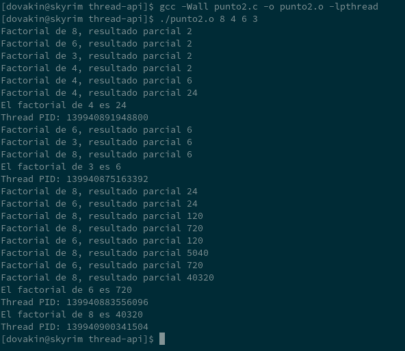

# Integrantes:
### **David Mejía Restrepo**
### **Andres Felipe Vasquez Ramirez**
# Actividad de laboratorio

1. Dado el siguiente código:

```C
#include <stdio.h>
#include <stdlib.h>
#include <unistd.h>
#include<time.h>

long long int factorial (int);

int main (int argc, char *argv[]) {
  srand(time(0)); 
  if (argc== 2) {
    printf ("El factorial de %s es %lld\n", argv[1], factorial (atoi (argv[1])));
  }
  return 0;
}

long long int factorial (int n) {
  long long int resultado= 1;
  int num;
  for (num= 2; num<= n; num++) {
    resultado= resultado*num;
    printf ("Factorial de %d, resultado parcial %lld\n", n, resultado);
    sleep (random()%3);
  }
  return resultado;
}
```

Modifique el programa anterior de manera que reciba dos números enteros como parámetros de entrada y calcule sus factoriales de manera concurrente utilizando dos hilos que se ejecutan en paralelo con el hilo principal. El hilo principal deberá esperar a que terminen los otros dos hilos. Recuerda  añadir el parámetro ```-lpthread``` al comienzo del ```gcc``` para compilar la aplicación multihilo.

>**Resultado:** 
>La solucion respectiva se encuentra en el archivo [punto1.c](code/punto1.c) y su ejecuable es [punto1.o](code/punto1.o), el programa solo acepta dos parametros de lo contrario muestra un mensaje de error, esta es una prueba del programa demostrando su funcionalidad:


***

2. Modifique el programa resultante del numeral anterior de manera que no el número de factoriales a calcular no este limitado a 2. Para este caso, el programa puede crear tantos hilos como sean necesarios para el cálculo del factorial dependiendo del número de argumentos pasados. El hilo principal deberá esperar a que terminen el resto de los hilos y a medida que vayan terminando muestran un mensaje que indique el identificador del hilo finalizado.

>**Resultado:** 
>La solucion respectiva se encuentra en el archivo [punto2.c](code/punto2.c) y su ejecuable es [punto2.o](code/punto2.o), el programa acepta cualquier cantidad de parametros exceptuando cero, en tal caso muestra un mensaje de error, esta es una prueba del programa demostrando su funcionalidad:



***

3. El siguiente programa cuenta el número de veces que el carácter a o A aparece en el fichero indicado como parámetro de entrada. Modifíquese para que ahora se cree un hilo y sea este el que ejecute la función cuenta.

```C

#include <unistd.h>
#include <stdlib.h>
#include <stdio.h>
#include <sys/types.h>
#include <sys/stat.h>
#include <fcntl.h>

#define MAXLON 1000

void cuenta (char *);

int main (int argc, char *argv[]) { 
  if (argc!= 2) {
    printf ("Indica el nombre de un fichero.\n");
    exit(0);
  }
  cuenta(argv[1]);
  return 0;
}

void cuenta (char *nombre) {
  int pos, cont= 0, leidos;
  char cadena[MAXLON];
  int fd;
  fd= open(nombre,O_RDONLY);
  while ((leidos =read(fd,cadena,MAXLON))!= 0) {
    for (pos= 0; pos< leidos; pos++) {
      if ((cadena[pos]== 'a') || (cadena[pos]== 'A')) {
        cont++;
      }
    }
  }
  printf("Fichero %s: %d caracteres 'a' o 'A' encontrados\n", nombre, cont);
  close(fd);
}
```
>**Resultado:** 
>La solucion respectiva se encuentra en el archivo [punto3.c](code/punto3.c) y su ejecuable es [punto3.o](code/punto3.o), el programa acepta un parametro para indicar el archivo, se probo con el archivo ```file1``` que contiene 8 veces la letra *a* o *A*, en tal caso de ingresar un archivo erroneo muestra un mensaje de error, esta es una prueba del programa demostrando su funcionalidad:


***

4. Modifique el programa resultado del ejercicio anterior para que se creen tantos hilos como ficheros especificados como parámetros de entrada de tal manera que todos los hilos lleven a cabo su función de forma concurrente.

>**Resultado:** 
>La solucion respectiva se encuentra en el archivo [punto4.c](code/punto4.c) y su ejecuable es [punto4.o](code/punto4.o), el programa acepta cualquier cantidad de parametros para indicar los archivo que se analizaran, se probo con el archivo ```file1``` y ```file2```, en tal caso de ingresar un archivo erroneo muestra un mensaje de error, esta es una prueba del programa demostrando su funcionalidad:


***

5. Se requiere un programa que reciba un vector de números a través de un archivo de texto. La idea es que el programa sume todos los números del vector. Implemente el programa de dos maneras: la primera de una forma estrictamente secuencial. La segunda forma es creando dos hilos, de manera que cada uno de ellos realice la sumatoria de la mitad de los componentes del vector. El hilo 1 sumará los primeros datos del vector y el hilo 2 los últimos. Luego cuando los dos hilos finalicen muestre en pantalla el resultado.
   * Realice el programa de manera genérica, de tal forma que sea posible ingresar vectores de cualquier tamaño.
   * Mida el tiempo de ejecución de ambas implementaciones para varios tamaños del vector 
   *  ¿El resultado obtenido es acorde a lo que usted esperaba?
   Describa la técnica que usó para realizar la medición del tiempo. ¿Cuáles son las debilidades de esta técnica? ¿Existe otra forma de medir el tiempo de ejecución de un programa?

>**Resultado:** 
>La primera solucion se encuentra en el archivo [punto5-wot.c](code/punto5-wot.c) y su ejecuable es [punto5-wot.o](code/punto5-wot.o) el cual realiza la suma de manera secuencial, y la segunda solucion se encuentra en el archivo [punto5-wt.c](code/punto5-wt.c) y su ejecuable es [punto5-wt.o](code/punto5-wt.o) que utiliza dos hilos para hacer la suma, cada programa recibe como parametro un archivo con el vector (Este viene configurado como valor por linea del documento), se probo con el archivo ```notas.csv``` (mismo archivo usado en el proximo ejercicio) en tal caso de ingresar un archivo erroneo muestra un mensaje de error, esta es una prueba del programa demostrando su funcionalidad:


>Se evidencia que los tiempos de ejecucion del programa con dos hilos es mayor a el que soluciona el problema de manera secuencial, esto es acorde a lo que se esperaba puesto la creacion de hilos (pthread_create) y el hecho de que se deban esperar para poder llegar a un resultado (pthread_join), consumen tiempo de ejecucion, este tiempo valga aclarar esta incluido en el tiempo de ejecucion, por tal motivo la creacion de los hilos principalmente ocupa más tiempo que la suma de un vector.
>Para medir el tiempo en el programa secuencial se hizo de la siguiente manera:
```C
...
clock_t begin = clock();
/* Llamada a la funcion encargada de sumar // Creacion de hilos con la funcion respectiva y join de los mismos para luego sumar sus resultados */
clock_t end = clock();
double time_spent = (double)(end - begin) / CLOCKS_PER_SEC;
...
```
>Aqui se evidencia que se esta contando el tiempo creacion de los hilos, adicional el tiempo que tardan ejecutarse y el join de los mismos.

***

6. El profesor de un curso desea un programa en lenguaje C que calcule la desviación estándar (símbolo σ o s) de las notas obtenidas por sus estudiantes en el curso 


**Requisitos**:
* El número de notas es variable (se debe usar memoria dinámica).
* El programa debe crear tantos hilos como se especifique en el parámetro de entrada cantidad_hilos, se debe ejecutar así: 

```./nombre_ejecutable fichero_notas.csv cantidad_hilos```

* Para calcular la desviación estándar, implemente la función: ```calculate_standard_deviation()``` 

>**Resultado:** 
>La solucion respectiva se encuentra en el archivo [punto6.c](code/punto6.c) y su ejecuable es [punto6.o](code/punto6.o), el programa acepta dos parametros para indicar el archivo .csv que se analizaran y la cantidad de hilos destinadas a ello, se probo con el archivo ```notas.csv``` quien contiene notas variables entre 1 y 1000, en tal caso de ingresar un archivo erroneo muestra un mensaje de error, esta es una prueba del programa demostrando su funcionalidad:


